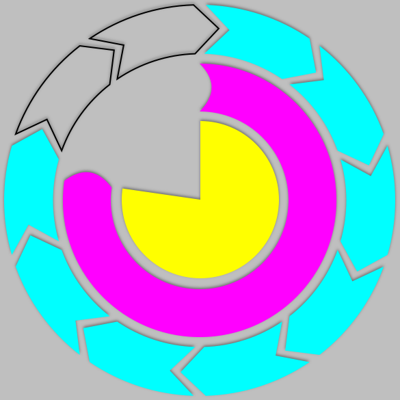

HKCircularProgressView
======================

HKCircularProgressView is a simple discrete/continuous circular progress view with current/max properties, customizable appearance and animatable.

How to use it
-------------

1. Use [CocoaPods](http://www.cocoapods.org) by adding *pod 'HKCircularProgressView'* in your Podfile.
2. Manually:
  * Clone this repository
  * Copy HKCircularProgressView and HKCircularProgressLayer files (.h and .m) into your project.
  * #import "HKCircularProgressView" and add the view as a subview (you can also do this from a .xib file).

How to configure it
-------------------

The main properties are:

* Max: the maximum value.
* Current: the current value (the progress will be current/max).
* Step: if 0 then it will be a continuous progress view. If not, it will be a discrete progress view with (max/step) markers.

You can also configure the appearance of the view (also accessible through [HKCircularProgressView appearance]):

* progressTintColor: the color of the progression.
* trackTintColor: the color of the track (which is the part that is not yet completed).
* animationDuration: the duration of the animations.
* fillRadius: the amount of the circle that is filled. 1 draws a full circle, 0.5 draws half a circle (a ring), 0.25 a quarter, etc.
* startAngle: the angle, in radius, where the progression begins.
* drawFullTrack: indicates whether the track is fully drawn or not. YES will always draw a full circle of 'trackColor' color.
* outlineWidth: if 0 (by default), does nothing. If > 0 draws outlines for non-completed progress parts.
* outlineColor: color of the outlines, set to _progressTintColor_ by default.
* endPoint: specifies how the progress' end-points (start and end) will be drawn. Default is flat ( _HKCircularProgressEndPointFlat_ ) but the project contains 2 other built-in end-points: _HKCircularProgressEndPointRound_ and _HKCircularProgressEndPointSpike_. The screenshot above shows all those 3 examples. You can create your own end-point by using the _HKCircularProgressEndPointDrawer_ protocol.

If you want to use a HKCircularProgressView as a substitute for UIActivityIndicator, you can use the following methods to start/stop an animation that rotates the view clockwise:

* startAnimating.
* stopAnimating.